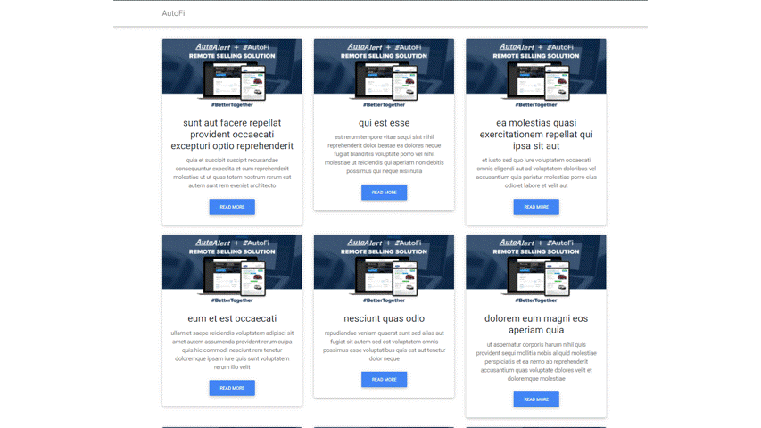
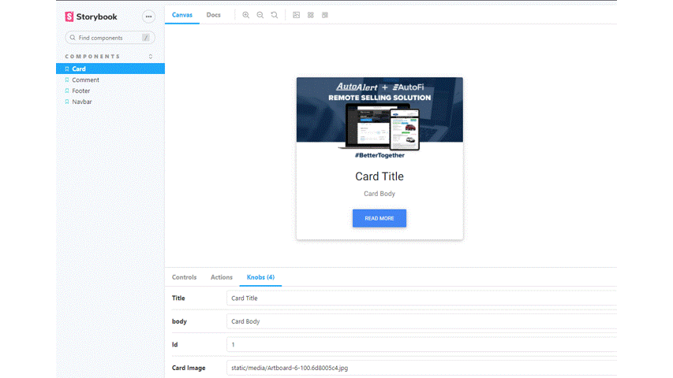

# Frontend-proximity-challenge [](https://travis-ci.com/CristianTurcios/Frontend-proximity-challenge)

## Live Demo

you can see a live demo on site [here](https://reverent-williams-8e90c8.netlify.app/).

## Documentation - Live Demo

You can see a live demo of the documentation of the components created using storybook [here](https://peaceful-jang-0b0123.netlify.app/).

## Installation

```bash
$ npm install
```

## Running the app

```bash
# development
$ npm run start
```

## Test

```bash
# unit tests
$ npm run test
```

## StoryBook

```bash
# storybook
$ npm run storybook


## Web App Screenshots



## Storybook Screenshots


